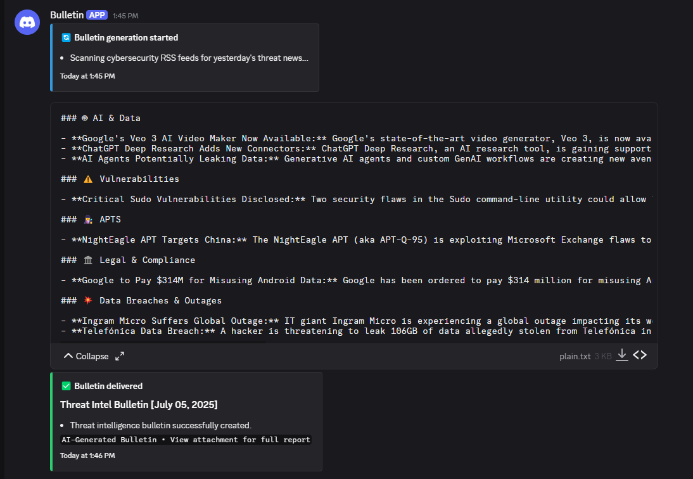

# 📰 AI Threat Intelligence Bulletin System

> **A tool I built to automate daily cybersecurity news analysis and deliver threat intel bulletins**

Tired of manually reading through dozens of cybersecurity news sources every morning to stay updated on threats? I created this automation system that monitors RSS feeds, uses AI to analyze and categorize threats, then delivers professional bulletins straight to your Discord. It's a personal project for my portfolio, but I hope it helps other cybersecurity folks stay informed without the manual grind.



[](https://docker.com) [](https://ai.google.dev) [](https://n8n.io) [](https://discord.com) [](https://supabase.com)

## 🎯 The Problem I'm Solving

After spending way too much time manually checking cybersecurity news sources every morning, I realized we all face the same frustrations:

- **⏰ Reading takes forever** - Checking Bleeping Computer, Dark Reading, Threat Post, and others eats up your morning
- **🎯 Easy to miss important stuff** - Critical threats get buried in the noise of regular security news
- **📊 Information overload** - Dozens of articles with no good way to prioritize what matters
- **🔄 Same routine every day** - Manually scanning the same sources over and over
- **📱 Hard to share with the team** - Copy-pasting links into Slack isn't scalable

## 💡 What I Built

So I built this **AI Threat Intelligence Bulletin System** to automate the tedious morning routine:

✨ **AI Does the Reading** - Google Gemini LLM reads all the articles and understands what's actually important  
🤖 **Workflows Handle Everything** - n8n orchestrates the entire news processing pipeline automatically  
📱 **Discord Delivers Bulletins** - Professional threat intel summaries delivered to your team channel  
🐳 **Easy Setup** - Just run `docker compose up -d` and you're getting daily bulletins  
🕙 **Daily at 10 AM** - Set-and-forget automation that runs every morning  

## 👥 Who Might Find This Useful

If you're dealing with cybersecurity news overload, this might help:

- **🛡️ SOC Teams** - Get structured threat briefings for morning stand-ups
- **🕵️ Threat Hunters** - Stay updated on latest TTPs without manual reading
- **📡 Threat Intel Analysts** - Process multiple news sources automatically
- **👁️ Security Managers** - Executive summaries for leadership updates
- **🔒 Security Consultants** - Client briefings with professional formatting
- **🏢 MSP Teams** - Threat intelligence as a service for clients

## 🚀 Quick Start

### One-Command Deployment
```bash
# Clone the repository
git clone https://github.com/brunosergi/ai-threat-intel-bulletin.git
cd ai-threat-intel-bulletin

# Configure environment
cp .env.example .env
# Edit .env with your API keys

# Launch the entire platform
docker compose up -d
```

**That's it!** 🎉 You'll get your first bulletin tomorrow at 10 AM.

### Access Your Services
- **🎛️ n8n Workflow Editor**: http://localhost:5678
- **🗄️ Supabase Database**: http://localhost:8000
- **📱 Discord**: Bulletins delivered to your webhook channel

## 🛠️ What's Under the Hood

### Core Tools
- **[n8n](https://n8n.io)** - Visual workflows that connect everything together
- **[Supabase](https://supabase.com)** - Backend PostgreSQL database with vector embeddings
- **[Google Gemini](https://ai.google.dev)** - The LLM that actually reads and analyzes news articles
- **[Discord Webhooks](https://discord.com)** - Where your team gets the daily bulletins
- **[Docker](https://docker.com)** - Everything runs in containers

### RSS Sources
- **Bleeping Computer** - General cybersecurity news and vulnerabilities
- **Dark Reading** - Enterprise security and threat intelligence  
- **Threat Post** - Latest cyber attacks and threat actor campaigns

## 📋 How It Works

1. **📡 RSS Monitoring** - System checks 3 major cybersecurity news sources every morning
2. **🔍 Smart Filtering** - Only processes yesterday's news (no duplicates, no old articles)
3. **🤖 AI Analysis** - Gemini reads each article and categorizes threats by type
4. **📝 Bulletin Generation** - Creates professional markdown summaries with source links
5. **📱 Discord Delivery** - Sends bulletin to your team channel with file attachment
6. **💾 Database Storage** - Saves everything for historical analysis and future RAG queries

## 🎯 Sample Bulletin Output

```markdown
# Threat Intel Bulletin [January 15, 2025]

## 🛠️ Tools & Techniques
- **New Covert Data Transfer Tool:** Researchers discovered 'Chirp', an audio-based 
  data exfiltration tool that uses sound frequencies to transfer data between devices. 
  [🔗¹](https://example.com/chirp-tool) #exploit #datatransfer

## 💥 Ransomware
- **Medusa Group Escalates Operations:** Medusa ransomware hit 400+ victims with 
  demands ranging $100K-$15M. Group shows sophisticated targeting of healthcare 
  and critical infrastructure. [🔗¹](https://example.com/medusa) [🔗²](https://other-example.com/medusa2) #ransomware #apt

## 🎣 Phishing & Social Engineering  
- **Mobile Parking Scam Campaign:** Widespread SMS phishing impersonating parking 
  departments across US cities, targeting financial credentials through fake 
  payment portals. [🔗¹](https://example.com/parking-scam) #phishing #mobile
```

## 💡 V1 MVP Features

✅ **RSS Feed Aggregation** - 3 major cybersecurity news sources  
✅ **AI Summarization** - Google Gemini powered threat analysis  
✅ **Daily Automation** - Set-and-forget 10 AM delivery schedule  
✅ **Discord Integration** - Rich embeds with file attachments  
✅ **Database Storage** - Historical bulletin tracking  
✅ **Error Handling** - Robust workflow with failure notifications  
✅ **Docker Deployment** - One-command setup and scaling

## 🗺️ What I'm Planning Next

### 🧠 **Smarter AI & Chat Features**
- **RAG Chat Interface** - Ask questions about historical bulletins using vector search
- **Zed AI Integration** - Long-term memory to chat with news trends over time
- **AI Model Selector** - Switch between Gemini, OpenAI, Claude and others directly in n8n
- **Structured JSON Output** - Better data parsing for integration with other tools
- **AI Content Scraping** - Fetch full article content for more detailed analysis

### 🔍 **Advanced Threat Detection**  
- **IoC Extraction** - Automatically identify indicators of compromise from articles
- **APT Recognition** - Detect known threat actors and adversaries mentioned in news
- **Auto-tagging** - Categorize by sector, threat type, country, victims, etc.

### 📊 **Enhanced Bulletins & Reports**
- **Better Deduplication** - Handle duplicate source links with Supabase RPC functions
- **Visual Bulletin Covers** - Generate professional images for each bulletin
- **Audio Summaries** - 1-minute AI-generated audio briefings of daily threats  
- **Multi-language Support** - Bulletin translation and international news sources
- **Trend Reports** - Weekly/monthly/yearly threat landscape analysis
- **Human-in-the-Loop** - Approval workflow to review and adjust bulletins

### 🤖 **Better User Experience**
- **Discord Bot** - Slash commands for bulletin management and queries
- **Next.js Frontend** - Web interface for bulletins blog (vibe coded)
- **Smarter Error Handling** - Better workflow logic when no news is available
- **Flexible Scheduling** - Custom timing beyond the 10 AM default

These features will transform it from a simple news aggregator into a comprehensive threat intelligence platform. The goal is to make it useful enough that security teams actually rely on it for their daily threat briefings.

---

<div align="center">

**⭐ Star this repo if you find it useful!**

[📖 Setup Guide](SETUP.md) • [⚙️ Workflows](WORKFLOWS.md)

Just a guy building tools for the cybersecurity community 🛡️

</div>